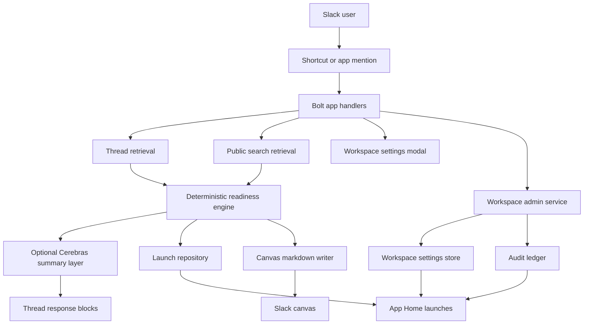

# Architecture

GoSignal is a Slack-native launch readiness agent with a deterministic
decisioning core and an optional LLM phrasing layer.

## High-Level Flow

## Slack Surfaces

- Agent view
- App Home
- Message shortcut
- Thread replies
- Markdown canvas
- App DMs for follow-up questions about an already analyzed launch

## Component Map

| Component | Files | Responsibility |
| --- | --- | --- |
| App bootstrap and routes | `src/app.ts`, `src/index.ts`, `src/http/customRoutes.ts` | Starts the Bolt app, serves health routes, and wires dependencies |
| Slack handlers | `src/handlers/registerHandlers.ts` | Receives app mentions, shortcut invocations, App Home opens, DMs, and block actions |
| Thread and search retrieval | `src/services/slackSources.ts` | Reads launch threads, public search context, and writes canvases |
| Readiness engine | `src/domain/readiness.ts`, `src/domain/textSignals.ts`, `src/domain/constants.ts` | Classifies approvals, blockers, ambiguity, rollback, dependencies, and next action |
| Launch orchestration | `src/services/launchService.ts` | Combines retrieval, readiness evaluation, summary generation, persistence, and canvas writing |
| Workspace admin service | `src/services/workspaceAdminService.ts` | Resolves workspace settings, records audit events, and drives the admin App Home behavior |
| Optional LLM layer | `src/services/llmProvider.ts` | Rewrites grounded results into more natural text, with deterministic fallback |
| Persistence | `src/repositories/memoryLaunchRepository.ts`, `src/repositories/postgresLaunchRepository.ts`, `src/repositories/workspaceAdminRepository.ts`, `src/repositories/schema.sql` | Stores launch records, workspace settings, and audit events |
| UI rendering | `src/ui/blocks.ts`, `src/ui/canvas.ts`, `src/ui/appHome.ts` | Builds thread blocks, canvas markdown, and App Home surfaces |
| Verification | `src/scripts/checkLlm.ts`, `src/scripts/smoke.ts` | Verifies the LLM path and the production artifact |

## Storage Model

The primary persisted object is a `LaunchRecord`, which includes:

- `workspaceId`
- `sourceChannelId`
- `sourceThreadTs`
- launch name and status
- category states
- approvals
- blockers
- evidence excerpts
- final decision snapshot
- canvas linkage

The workspace admin layer also persists:

- `WorkspaceSettingsRecord` for search mode and audit retention
- `AuditEventRecord` for operator-visible actions such as analyze, rerun,
  sign-off request, canvas open, and settings updates

Workspace isolation is achieved through repository queries that always scope to
`workspace_id`, plus a unique index on:

- `workspace_id`
- `source_channel_id`
- `source_thread_ts`

## Deterministic And LLM Boundaries

Deterministic logic is the source of truth for:

- overall state
- blocker detection
- missing approvals
- dependency risk
- ambiguity
- next action

Optional LLM usage is limited to:

- natural summary phrasing
- natural DM answers about an existing launch

The LLM does not override a deterministic red, yellow, green, or
`needs_review` state.

## Deployment Topology

Current deployment target:

- Render Web Service
- Node.js 22
- built artifact from `dist/`
- `server.js` as the production entrypoint

Health endpoints:

- `GET /`
- `GET /healthz`

Repository verification path:

- `npm run verify`
- `npm run smoke`

## Current Trust Boundaries

- Launch analysis is public-first in the current MVP.
- Public Slack thread messages form the main evidence base.
- Public search evidence is only used when a user-triggered action provides an
  action token.
- Workspace settings can disable live search entirely and force thread-only
  analysis.
- The thread board and markdown canvas both surface evidence receipts and live
  search diagnostics from the current run.
- LLM output is grounded in structured launch data prepared by the deterministic
  layer.

## Known Architectural Gaps Before Final Submission

- There is no dedicated installation store or encrypted token store yet.
- There is no self-service deletion UI or automated retention purge yet.
- Final Marketplace request URLs and five-workspace proof are external to the
  repository and still pending.
